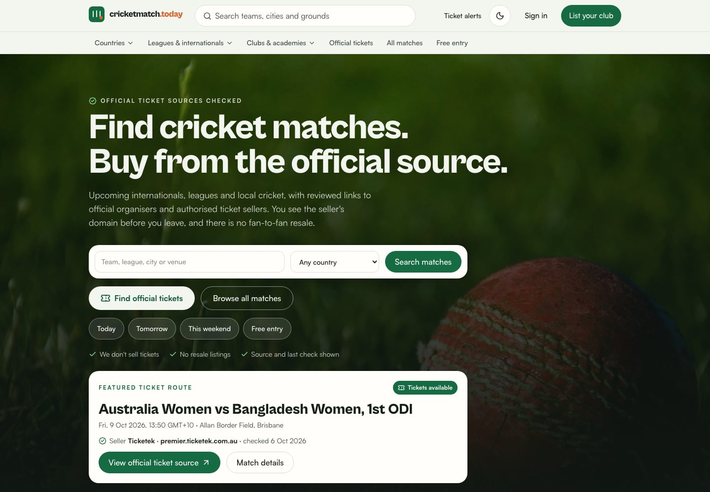
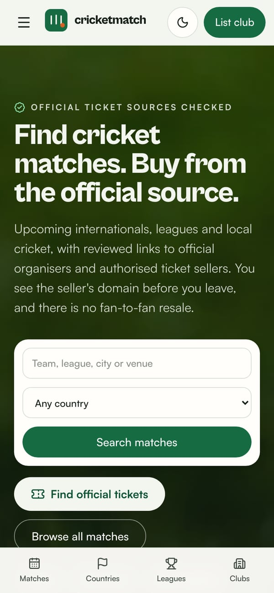
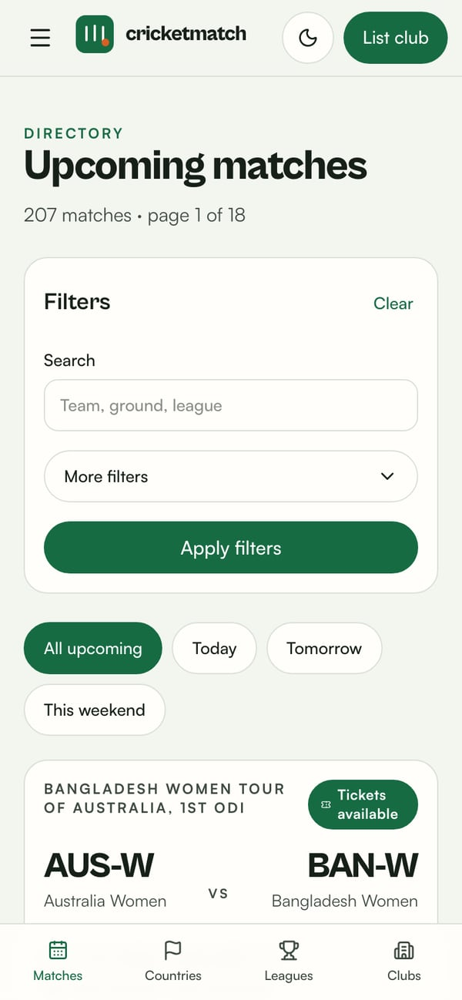
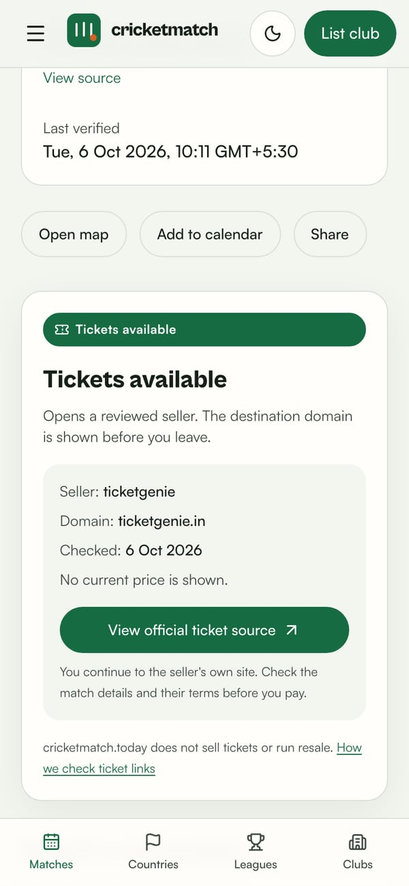
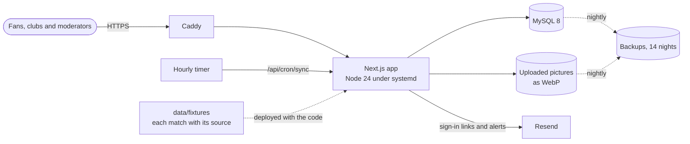

<p align="center">
  <a href="https://cricketmatch.today"></a>
</p>

<h1 align="center">cricketmatch.today</h1>

<p align="center">
  <strong>Find the match. Feel the ground.</strong><br>
  Every upcoming cricket match, from internationals to local clubs, with its ground, its local start time and the official way to get a ticket.
</p>

<p align="center">
  <a href="https://cricketmatch.today"><strong>Live site</strong></a> ·
  <a href="#what-it-does">What it does</a> ·
  <a href="#engineering-highlights">Engineering</a> ·
  <a href="#run-it-locally">Run it locally</a> ·
  <a href="#team">Team</a>
</p>

<p align="center">
  <a href="https://github.com/gaganggoyal/crictoday/actions/workflows/ci.yml"></a>
  
  
  
  
</p>



## At a glance

- **A live product.** [cricketmatch.today](https://cricketmatch.today) has served real fixtures since October 2026: over 200 matches in India, Australia, South Africa, New Zealand, Pakistan, Bangladesh and the UAE, and the BBL, WBBL and SA20. Most have an official ticket link that a person has checked.
- **Full-stack TypeScript.** Next.js 16 App Router with React Server Components and server actions, MySQL 8 and Tailwind CSS 4.
- **Well tested.** Over 150 Vitest unit and integration tests, some against a real MySQL 8 server and some against Postgres row-level security, plus 26 Playwright end-to-end tests. CI runs them all on every push.
- **Self-hosted.** It runs on a Linux VPS with systemd, Caddy for HTTPS, an hourly data sync, nightly backups and a one-command deploy.
- **Founder-led.** Gagan leads product and engineering. Co-founder Vansh brings a young cricketer's view of what players and fans need.

## What it does

**For fans**

- Browse by country, Indian state and town, league and season, team or ground, or search. The today, tomorrow and this weekend shortcuts use the date at each ground, and a Test counts on all five days.
- Each match shows its start time at the ground and in the visitor's own time zone, and can be added to a calendar.
- Ticket links go only to official sources or to sellers the organiser has authorised, never to resale. Each shows the seller, its domain and when a person last checked it, and passes through a page that names the seller before the fan leaves. [How we check ticket links](https://cricketmatch.today/how-we-check-ticket-links) sets out the rules. When a sale has not opened yet, fans can ask to be emailed when it does.

**For clubs and academies**

- A free profile with a logo, photos, coaching, trials and other offers, and WhatsApp and social links.
- Matches can be posted one at a time, or a whole season can be uploaded from Excel, Google Sheets or a CSV file.

**For moderators**

- Queues for new profiles, ticket links, corrections and submissions, with an audit log.

<p align="center">
  
  
  
</p>

## Engineering highlights

- **Rules in pure, tested functions.** Each match has exactly one attendance state, such as `OFFICIAL_LINK`, `SOLD_OUT` or `IN_PLAY`, worked out from its offers, its status and the time in [`lib/domain/ticket-state.ts`](lib/domain/ticket-state.ts). A ticket link goes public only after a moderator approves it. Links that are not HTTPS, or that use a URL shortener, are refused ([`lib/domain/urls.ts`](lib/domain/urls.ts)).
- **Time zones done properly.** Start times are stored in UTC with the ground's IANA time zone. "Today" means today at the ground, and calendar files follow RFC 5545 ([`lib/domain/time.ts`](lib/domain/time.ts), [`lib/domain/filters.ts`](lib/domain/filters.ts), [`lib/domain/calendar.ts`](lib/domain/calendar.ts)).
- **Spreadsheets are read in the browser.** A small .xlsx reader runs on the owner's device and refuses compressed bombs, so the server never opens an uploaded workbook. The schedule reader understands day-first dates, Excel's date numbers and times like "9.30 am". Uploading the sheet again updates only the rows that changed ([`lib/sheets/xlsx.ts`](lib/sheets/xlsx.ts), [`lib/domain/schedule.ts`](lib/domain/schedule.ts)).
- **Uploads are treated as hostile.** A picture's format is checked from its first bytes before any decoder sees it, and SVG is never decoded. Every photo is turned upright, stripped of camera and GPS data and re-encoded as WebP with sharp ([`lib/media/store.ts`](lib/media/store.ts)).
- **Privacy by design.** Addresses for ticket alerts are encrypted with AES-256-GCM and looked up by an HMAC. Sign-in uses single-use links that expire after 30 minutes, sessions are HMAC-signed cookies, and rate limits are kept in the database ([`lib/security/`](lib/security)).
- **Search and sharing.** Every match has its own title and description, and a test checks that they are unique across all the real fixtures. Pages carry schema.org `SportsEvent` data, with an `Offer` only for a real, approved sale, and breadcrumbs. Sitemap dates come from the database, and each match draws its own 1200×630 link preview with `next/og` ([`lib/seo.ts`](lib/seo.ts), [`lib/og.tsx`](lib/og.tsx)).
- **One app, three data backends.** The same pages run on MySQL in production, on Supabase (Postgres with row-level security), or on a labelled demo store for local work. Environment variables choose between them ([`lib/data/mode.ts`](lib/data/mode.ts)).
- **An idempotent hourly sync.** It applies the reviewed fixture files, runs any provider import under a lock so that two runs never overlap, and expires ticket links for matches that have started. It then emails the alerts that new ticket links answer ([`lib/providers/fixture-sync.ts`](lib/providers/fixture-sync.ts), [`lib/data/mysql/import.ts`](lib/data/mysql/import.ts)).
- **Secure headers by default.** The site sends a Content Security Policy, HSTS with preload, `frame-ancestors 'none'`, `nosniff` and a locked-down permissions policy ([`next.config.ts`](next.config.ts)).
- **Built for phones first.** Pages are server-rendered and filters are plain GET forms, so every view has a shareable URL. The layout works from 320 px phones to wide desktops in light and dark themes, and an end-to-end test checks that no page scrolls sideways on a phone.

## Tech stack

| Area      | Tools                                                                                     |
| --------- | ----------------------------------------------------------------------------------------- |
| App       | Next.js 16 (App Router, Server Components, server actions), React 19, TypeScript (strict) |
| UI        | Tailwind CSS 4, self-hosted fonts, light and dark themes, Lucide icons                    |
| Data      | MySQL 8 through mysql2 in production; Supabase and Postgres with row-level security       |
| Forms     | Zod 4, React Hook Form                                                                    |
| Email     | Resend or SMTP through Nodemailer, with HTML and plain-text versions of every message     |
| Images    | sharp for uploads, `next/og` for link previews                                            |
| Tests     | Vitest, PGlite (Postgres in process), MySQL 8 integration suites, Playwright              |
| Hosting   | Ubuntu VPS, systemd service and timers, Caddy                                             |
| Pipelines | GitHub Actions: lint, types, formatting, unit, MySQL and end-to-end tests, build          |

## Architecture



## Repository layout

```text
app/            Routes: public pages, club dashboard, admin, cron API, link previews, sitemap
components/     UI by area: match, profile, forms, layout and admin
lib/domain/     Pure rules: ticket states, filters, time zones, schedules and workflows
lib/data/       Data access for MySQL, Supabase and the demo store behind one interface
lib/            Also auth, security, email, media, spreadsheets, providers and SEO
data/fixtures/  Real fixtures and ticket links, each with its official source
db/mysql/       MySQL migrations
supabase/       Postgres migrations with row-level security
deploy/vps/     systemd units, Caddy config, and the deploy, sync and backup scripts
tests/          Vitest suites and Playwright end-to-end tests
docs/           Plan, deployment guide and progress log
```

## Run it locally

You need Node 24 and pnpm 10. Running `corepack enable` installs the right pnpm.

```bash
pnpm install
pnpm dev
```

Open http://127.0.0.1:3000. Without a database the app runs on a labelled demo catalogue, so the demo banner is intentional. The demo is dated October 2026; to see it as it was then, run `DEMO_NOW=2026-10-05T12:00:00Z pnpm dev`, as the end-to-end tests do. These sign-in addresses work only in local development, and the sign-in page shows the link instead of emailing it:

- `admin@cricketmatch.today`
- `moderator@cricketmatch.today`
- `organiser@cricketmatch.today`
- `academy@cricketmatch.today`

To use MySQL, copy [`.env.example`](.env.example) to `.env.local`, set `DATABASE_URL`, and run `pnpm db migrate`. Then load the real fixtures with `pnpm db load-fixtures data/fixtures/2026-27.json`, or the demo catalogue with `pnpm db seed-demo`.

## Tests

```bash
pnpm run ci     # lint, typecheck, unit tests and the production build
pnpm test:e2e   # Playwright, against the dev server
MYSQL_TEST_URL=mysql://root@127.0.0.1:3306 pnpm test   # adds the MySQL integration suites
```

The MySQL suites create and drop their own `cm_t_*` databases. [CI](.github/workflows/ci.yml) runs everything on every push and pull request.

## Deployment

Production runs `next start` under systemd behind Caddy, with MySQL 8 on the same server, an hourly sync timer and nightly backups. [`deploy/vps/deploy.sh`](deploy/vps/deploy.sh) checks out `main`, installs, builds, applies new migrations, restarts the service and waits until it answers. [docs/deployment.md](docs/deployment.md) has the full setup, including an alternative on Supabase and Vercel.

## Status

Live since 5 October 2026. Next come Google Search Console, the first club and academy profiles, a licensed live fixtures feed and automatic off-server backups. The [progress log](docs/progress.md) has the detail, and the [implementation plan](docs/implementation-plan.md) has the product rules.

## Team

- **Gagan**, founder ([@gaganggoyal](https://github.com/gaganggoyal)). An engineer from one of India's top engineering colleges, Gagan leads product and engineering.
- **Vansh**, co-founder. Young, cricket-mad and set on becoming a cricketer, Vansh brings the player's view.

cricketmatch.today is from the team behind [indiaoffers.in](https://indiaoffers.in). Read more [about us](https://cricketmatch.today/about), or write to [hello@cricketmatch.today](mailto:hello@cricketmatch.today).
